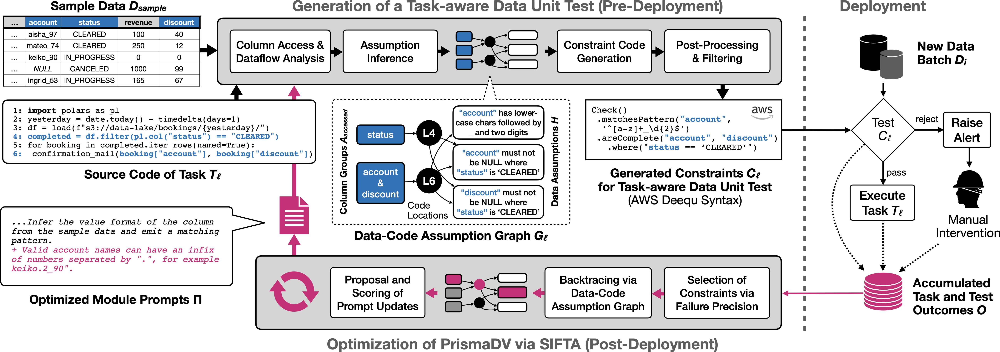

# PrismaDV

**Task-Aware Data Validation using Language Models**

## Architecture

**[PrismaDV](./prismadv)** analyzes downstream task code and sample data to automatically generate validation
constraints. **[SIFTA](./sifta)** (Selective Informative Feedback for Task Adaptation) adapts PrismaDV from observed
task and test outcomes, using failure precision to focus prompt updates on informative constraint failures.



---

## Benchmarks

Performance is evaluated using three comprehensive benchmarks for task-aware data validation:

- **[ICDBench](./benchmarks/ICDBench)** - Individual Constraint Discovery (63 test cases)
- **[EIDBench-synth](./benchmarks/EIDBench-synth)** - End-to-End Error Impact Detection (5 datasets, 60 tasks)
- **[EIDBench-real](./benchmarks/EIDBench-real)** - End-to-End Error Impact Detection on 3 real repo-derived tasks

See the complete [**benchmarks overview**](./benchmarks/) for detailed comparison and documentation.

---

### Get Started

1. **Install Poetry** (if not already installed):
   ```bash
   curl -sSL https://install.python-poetry.org | python3 -
   ```

2. **Install dependencies**:
   ```bash
   poetry install --with test,gx
   ```

3. **Create a `.env` file** with required API keys:
   ```bash
   OPENAI_API_KEY=your_openai_api_key
   HF_TOKEN=your_huggingface_token
   SPARK_VERSION=3.5
   ```

4. **Run tests**:
   ```bash
   poetry run pytest
   ```

### Intermediate Results

All task-aware data validation unit tests are saved in the [`data_processed/`](./data_processed) directory. This
directory contains unit tests for all tasks generated using different approaches.

**Example**: View the data unit tests that PrismaDV (GPT-5) generated
for [general_task_5.py](benchmarks/EIDBench-synth/IPL_win_prediction/scripts/general/general_task_5.py) from the
IPL_win_prediction dataset in
EIDBench-synth [here](./data_processed/IPL_win_prediction/general/1/constraints/general_task_5/prismadv--gpt-5--20251014_010844.yaml).
